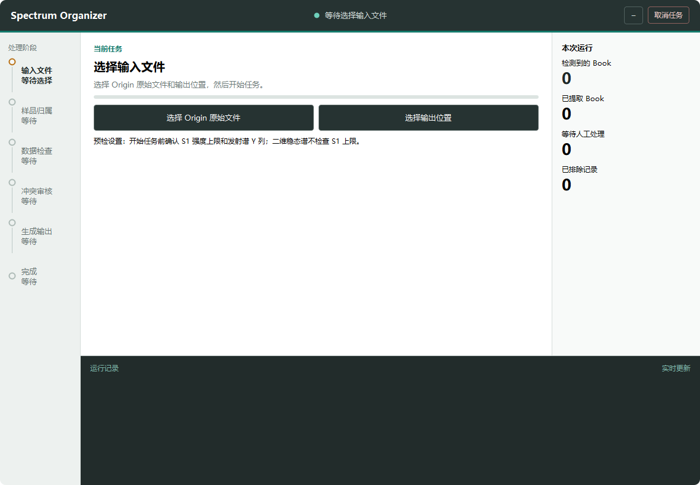

# Spectrum Organizer

面向 HORIBA FluoroMax-4 数据的 Origin 光谱整理工具。程序读取一个或多个原始项目，在界面中完成样品归属和冲突选择后，生成新的整理项目和运行报告；原始项目不会被修改。

[下载 v0.1.0](https://github.com/UFOcgj/Spectrum-Organizer/releases/tag/v0.1.0) · [查看更新记录](CHANGELOG.md) · [Windows 自动测试](https://github.com/UFOcgj/Spectrum-Organizer/actions/workflows/windows-tests.yml)



## 30 秒看懂

1. 选择一个或多个 `.opj` / `.opju` 原始项目和输出位置；
2. 在可回退的界面中确认样品归属，处理重复谱与特殊谱冲突；
3. 审核最终归属和输出结构，程序再调用 Origin 生成并独立校验结果。

最终得到一份新的 `Organized_Spectra_*.opju` 和配套的 `Run_Report_*.txt`。

## 从原始项目到可交付结果


界面负责需要实验人员判断的步骤；读取、生成和校验由边界清晰的工作进程执行。输出计划冻结后才会创建结果，生成文件还要经过独立回读和源文件复核。

## 数据安全与可追溯性

- 原始项目只通过任务校验副本读取，程序不会覆盖原文件或已有输出。
- 每次运行绑定本次启动的 Origin 进程，拒绝接管无关 Origin 实例。
- 取消任务会清理本次工作副本和任务进程；成功结果先校验，再原子发布到新目录。
- 运行报告记录输入、预设、人工决定、排除原因、Folder/Book 对应关系和完整性检查。

## 验证边界

当前代码库的完整自动化回归包含 1700 项测试，覆盖解析、归属、冲突、输出计划、进程边界、取消和打包契约。GitHub Actions 在 Windows 上运行不启动 Origin 的自动测试；真实 `.opj` / `.opju` 输出仍通过装有 Origin 的 Windows 10/11 环境人工验收。

## 当前版本边界

- 需要 Windows 10/11 64 位系统和已安装、已激活的 Origin 2021 或更高版本；当前实测版本为 OriginPro 2023。
- 当前版本不输出特殊谱，也不把样品归属写入长期样品库。

## 使用说明

### 一、下载并打开程序

程序适用于 Windows 10/11 64 位电脑。电脑上需要安装并激活 Origin 2021 或更高版本。程序自带 Python 组件，不需要另外安装 Python 或开发工具。

1. 打开本仓库的 **Releases** 页面，下载 `Spectrum_Organizer_*.zip`；
2. 将 ZIP 完整解压到一个普通文件夹；
3. 打开解压后的 `Spectrum Organizer` 文件夹；
4. 双击 `Spectrum Organizer.exe`。如果系统隐藏了扩展名，请找名称为 `Spectrum Organizer`、类型为“应用程序”的文件。

不要在 ZIP 压缩包里直接运行，也不要只复制 EXE。请保留整个 `Spectrum Organizer` 文件夹，不要移动、改名或删除 `_internal` 文件夹。

### 二、可以选择哪些原始文件

程序支持 `.opj` 和 `.opju` 原始项目，文件需能在当前电脑的 Origin 中正常打开。

一次任务可以只选一个文件，也可以同时选择多个。需要多选时，在文件选择窗口按住 Ctrl 或 Shift 再点击文件。

程序使用任务校验副本读取和整理，不会修改原始项目，也不会覆盖已有输出。正式数据仍建议另行备份，以防硬盘故障或误删。

### 三、程序会生成什么

程序读取选中的原始项目，完成样品归属和冲突选择后生成新的整理结果。输出目录中会有：

1. 一份新的 `Organized_Spectra_*.opju`；
2. 与它配套的 `Run_Report_*.txt`。

运行报告记录本次输入、预设参数、样品归属、冲突决定、排除原因、Folder/Book 对应关系和完整性检查。结果有异常时，可以用它定位具体步骤。请和对应的 `.opju` 一起保存。

当前版本不会输出特殊谱。当前版本不会把确认结果写入长期样品库。样品归属和冲突决定只对本次输出生效。

### 四、程序怎样整理输出项目

Folder 以发射谱的测试条件为主。发射谱狭缝不同，会进入不同的 Folder。

同一样品已选中的激发谱，会按温度和稳态/延迟类型匹配到对应的发射 Folder，不受发射谱狭缝限制。稳态谱与延迟谱不会混在一起。

同一 Folder 内，同一样品在不同温度下的数据放在同一个 Book 中。温度和具体测试条件保留在列信息里，不会靠拆成多个 Book 来区分。

归一化列保留为 Origin 中可计算的公式，不是一次性粘贴的数值。

为了避免乘号“×”在 Origin 输出项目中变成乱码，Book 名称和列注释里的浓度使用字母 `x`，例如 `1x10^-4 M`。程序界面和运行报告仍可能使用“×”，两种写法表示同一个浓度。

选中的 Book 不一定都进入最终项目。不支持的原始格式、人工排除项、冲突审核中未选中的候选，以及已经归入特殊谱且不应复制到普通输出的记录会被排除。界面或运行报告会说明具体原因，程序不会为了补齐结构而制造不存在的数据。

### 五、遇到问题怎么办

出错后先保留现场，不要修改原始项目后反复重试。记下报错阶段，保留截图和当次输出目录；如果已经生成运行报告，也一并保留。

程序日志位于：

```text
%LOCALAPPDATA%\Spectrum Organizer\logs
```

按 Win+R，粘贴上面的路径，再按回车。把时间最接近报错的日志连同截图交给软件提供者即可。原始数据如不便外传，只需说明文件名和出错步骤，不必直接发送。
